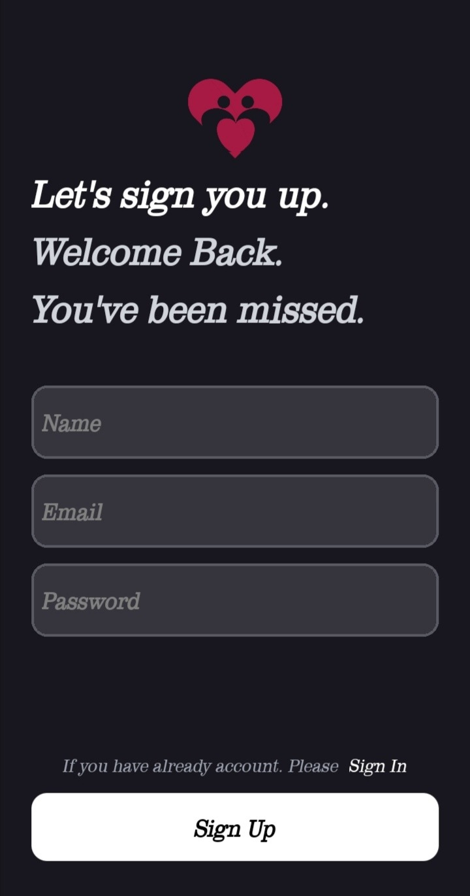
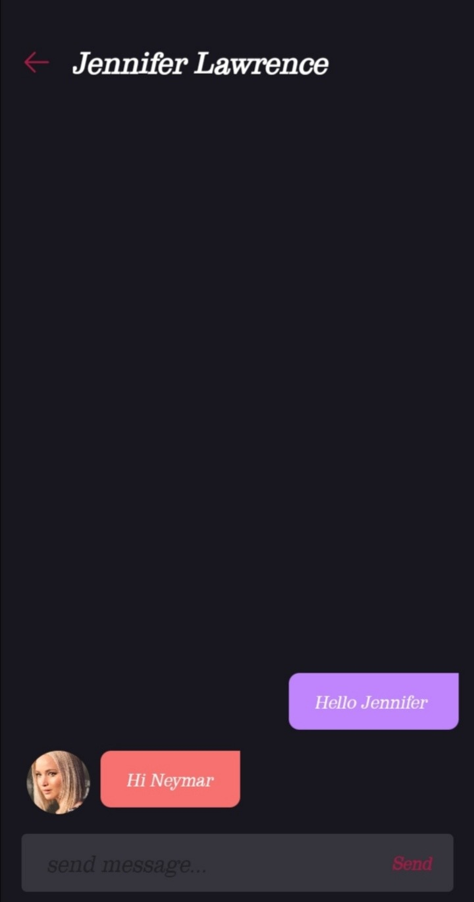

# Flirtee

Simple dating mobile application.

## Description

A simple ating mobile application. Users can create account and can swipe cards and can send message if users have liked each other.

## Getting Started
```
git clone git@github.com:Htetaungkyaw71/Flirtee.git
```
### Screenshot





### Live demo

* Flirtee 
[@Download Link](https://expo.dev/accounts/htetaungkyaw99/projects/flirtee/builds/9af3582e-fe3b-46bd-a8be-057a3e697553)

### Technologies
* React
* React Native
* Firebase
* Tailwind Css

### Installing
```
 yarn install
```

### Executing program

* How to run the program
```
expo start
```


## Authors

* Htetaungkyaw
[@Htetaungkyaw](https://github.com/Htetaungkyaw71)


## License

This project is licensed under the [NAME HERE] License - see the LICENSE.md file for details

